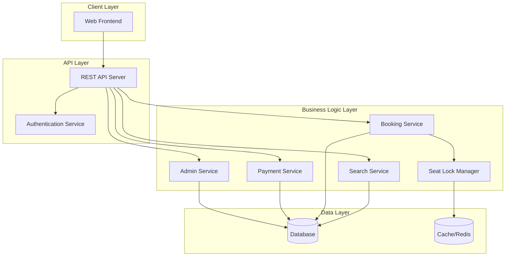

# Design Document: Bus Ticket Website

## Overview

The bus ticket booking website is a full-stack web application that enables users to search for bus routes, select seats visually, book tickets, and make payments. The system consists of a public-facing interface for travelers and an administrative interface for managing buses, routes, and bookings.

The architecture follows a client-server model with a RESTful API backend and a responsive web frontend. Key technical challenges include:

- **Seat locking and concurrency**: Preventing double bookings when multiple users select seats simultaneously
- **Real-time seat availability**: Ensuring seat status updates are reflected immediately across all users
- **Payment integration**: Handling payment workflows with proper state management
- **Data consistency**: Maintaining referential integrity across buses, routes, trips, and bookings

## Architecture

### System Components



### Technology Stack Considerations

The design is presented in pseudocode to remain language-agnostic. Recommended technologies:

- **Frontend**: React, Vue, or Angular with responsive CSS framework
- **Backend**: Node.js/Express, Python/Django, or Java/Spring Boot
- **Database**: PostgreSQL or MySQL for relational data
- **Cache**: Redis for seat locks and session management
- **Payment**: Stripe, PayPal, or Razorpay integration
- **File Storage**: AWS S3 or local storage for ticket PDFs

## Components and Interfaces

### 1. Search Service

Handles bus route searches with filtering, sorting, and bus selection capabilities.

```
interface SearchService {
    searchTrips(departureCity: String, destinationCity: String, date: Date, filters: SearchFilters): List<Trip>
    getCitySuggestions(prefix: String): List<City>
    getAvailableSeats(tripId: String): Integer
    getBusDetails(busId: String): Bus
    filterByBusOperator(trips: List<Trip>, operatorName: String): List<Trip>
}

structure SearchFilters {
    priceRange: (min: Decimal, max: Decimal)?
    departureTimeRange: (start: Time, end: Time)?
    busTypes: List<BusType>?
    minAvailableSeats: Integer?
    busOperators: List<String>?
}

structure Trip {
    id: String
    busId: String
    busCompany: String
    busNumber: String
    departureCity: String
    destinationCity: String
    departureTime: DateTime
    arrivalTime: DateTime
    duration: Duration
    availableSeats: Integer
    totalSeats: Integer
    price: Decimal
    busType: BusType
    amenities: List<String>
    rating: Decimal?
}

structure Bus {
    id: String
    companyName: String
    busNumber: String
    busType: BusType
    totalSeats: Integer
    amenities: List<String>
    rating: Decimal?
    seatLayout: SeatLayoutConfig
}

enum BusType {
    AC, NON_AC, SLEEPER, VIP
}

enum SortOption {
    CHEAPEST, FASTEST, EARLIEST_DEPARTURE
}

function searchTrips(departureCity, destinationCity, date, filters, sortOption):
    trips = database.query(
        "SELECT * FROM trips WHERE departure_city = ? AND destination_city = ? AND DATE(departure_time) = ?",
        departureCity, destinationCity, date
    )
    
    // Apply filters
    if filters.priceRange:
        trips = trips.filter(t => t.price >= filters.priceRange.min AND t.price <= filters.priceRange.max)
    
    if filters.departureTimeRange:
        trips = trips.filter(t => t.departureTime.time >= filters.departureTimeRange.start 
                                  AND t.departureTime.time <= filters.departureTimeRange.end)
    
    if filters.busTypes:
        trips = trips.filter(t => t.busType IN filters.busTypes)
    
    if filters.minAvailableSeats:
        trips = trips.filter(t => t.availableSeats >= filters.minAvailableSeats)
    
    if filters.busOperators:
        trips = trips.filter(t => t.busCompany IN filters.busOperators)
    
    // Apply sorting
    if sortOption == CHEAPEST:
        trips = trips.sortBy(t => t.price)
    else if sortOption == FASTEST:
        trips = trips.sortBy(t => t.duration)
    else if sortOption == EARLIEST_DEPARTURE:
        trips = trips.sortBy(t => t.departureTime)
    
    return trips

function getBusDetails(busId):
    bus = database.query("SELECT * FROM buses WHERE id = ?", busId)
    if bus == null:
        return Error("Bus not found")
    
    // Get average rating from completed trips
    rating = database.query(
        "SELECT AVG(rating) FROM trip_ratings WHERE bus_id = ?",
        busId
    )
    bus.rating = rating
    
    return bus

function filterByBusOperator(trips, operatorName):
    return trips.filter(t => t.busCompany == operatorName)
```

### 2. Seat Selection Service

Manages seat layout visualization and selection logic.

```
interface SeatSelectionService {
    getSeatLayout(tripId: String): SeatLayout
    selectSeat(tripId: String, seatNumber: String, userId: String): Result<SeatSelection>
    deselectSeat(tripId: String, seatNumber: String, userId: String): Result<Void>
}

structure SeatLayout {
    tripId: String
    rows: Integer
    columns: Integer
    seats: List<Seat>
}

structure Seat {
    number: String
    row: Integer
    column: Integer
    status: SeatStatus
    price: Decimal
}

enum SeatStatus {
    AVAILABLE, SELECTED, BOOKED, LOCKED
}

structure SeatSelection {
    seatNumber: String
    lockId: String
    expiresAt: DateTime
}

function getSeatLayout(tripId):
    trip = database.getTrip(tripId)
    bus = database.getBus(trip.busId)
    layout = bus.seatLayout
    
    // Get booked and locked seats
    bookedSeats = database.query("SELECT seat_number FROM bookings WHERE trip_id = ? AND status = 'confirmed'", tripId)
    lockedSeats = cache.getLockedSeats(tripId)
    
    // Build seat layout with status
    seats = []
    for each seatConfig in layout.seats:
        status = AVAILABLE
        if seatConfig.number in bookedSeats:
            status = BOOKED
        else if seatConfig.number in lockedSeats:
            status = LOCKED
        
        seats.append(Seat(
            number: seatConfig.number,
            row: seatConfig.row,
            column: seatConfig.column,
            status: status,
            price: trip.price
        ))
    
    return SeatLayout(tripId, layout.rows, layout.columns, seats)
```

### 3. Seat Lock Manager

Handles temporary seat reservations with timeout management.

```
interface SeatLockManager {
    acquireLock(tripId: String, seatNumbers: List<String>, userId: String): Result<LockInfo>
    releaseLock(lockId: String): Result<Void>
    extendLock(lockId: String, additionalMinutes: Integer): Result<Void>
    isLocked(tripId: String, seatNumber: String): Boolean
}

structure LockInfo {
    lockId: String
    tripId: String
    seatNumbers: List<String>
    userId: String
    expiresAt: DateTime
}

constant LOCK_TIMEOUT_MINUTES = 10

function acquireLock(tripId, seatNumbers, userId):
    // Check if any seat is already locked or booked
    for each seatNumber in seatNumbers:
        if isLocked(tripId, seatNumber):
            return Error("Seat already locked")
        
        if isBooked(tripId, seatNumber):
            return Error("Seat already booked")
    
    // Create lock
    lockId = generateUUID()
    expiresAt = currentTime() + LOCK_TIMEOUT_MINUTES minutes
    
    lockInfo = LockInfo(lockId, tripId, seatNumbers, userId, expiresAt)
    
    // Store in cache with TTL
    cache.set("lock:" + lockId, lockInfo, TTL: LOCK_TIMEOUT_MINUTES minutes)
    
    // Store seat-to-lock mapping
    for each seatNumber in seatNumbers:
        cache.set("seat_lock:" + tripId + ":" + seatNumber, lockId, TTL: LOCK_TIMEOUT_MINUTES minutes)
    
    return Success(lockInfo)

function isLocked(tripId, seatNumber):
    lockId = cache.get("seat_lock:" + tripId + ":" + seatNumber)
    return lockId != null

function releaseLock(lockId):
    lockInfo = cache.get("lock:" + lockId)
    if lockInfo == null:
        return Success() // Already expired
    
    // Remove seat locks
    for each seatNumber in lockInfo.seatNumbers:
        cache.delete("seat_lock:" + lockInfo.tripId + ":" + seatNumber)
    
    // Remove lock
    cache.delete("lock:" + lockId)
    return Success()
```

### 4. Booking Service

Manages the booking workflow from passenger details to confirmation.

```
interface BookingService {
    createBooking(bookingRequest: BookingRequest): Result<Booking>
    confirmBooking(bookingId: String, paymentId: String): Result<Booking>
    cancelBooking(bookingId: String, userId: String): Result<Void>
    getBooking(bookingId: String): Result<Booking>
    getUserBookings(userId: String): List<Booking>
}

structure BookingRequest {
    tripId: String
    seatNumbers: List<String>
    passengers: List<Passenger>
    userId: String?
    lockId: String
}

structure Passenger {
    name: String
    phone: String
    email: String
}

structure Booking {
    id: String
    pnr: String
    tripId: String
    userId: String?
    seatNumbers: List<String>
    passengers: List<Passenger>
    totalAmount: Decimal
    taxes: Decimal
    serviceFee: Decimal
    status: BookingStatus
    paymentId: String?
    createdAt: DateTime
    confirmedAt: DateTime?
}

enum BookingStatus {
    PENDING, CONFIRMED, CANCELLED, FAILED
}

function createBooking(bookingRequest):
    // Validate lock
    lockInfo = cache.get("lock:" + bookingRequest.lockId)
    if lockInfo == null:
        return Error("Lock expired")
    
    if lockInfo.tripId != bookingRequest.tripId:
        return Error("Lock mismatch")
    
    if lockInfo.seatNumbers != bookingRequest.seatNumbers:
        return Error("Seat mismatch")
    
    // Validate passenger count
    if bookingRequest.passengers.length != bookingRequest.seatNumbers.length:
        return Error("Passenger count must match seat count")
    
    // Calculate pricing
    trip = database.getTrip(bookingRequest.tripId)
    baseAmount = trip.price * bookingRequest.seatNumbers.length
    taxes = baseAmount * 0.05  // 5% tax
    serviceFee = baseAmount * 0.02  // 2% service fee
    totalAmount = baseAmount + taxes + serviceFee
    
    // Create booking
    pnr = generatePNR()
    booking = Booking(
        id: generateUUID(),
        pnr: pnr,
        tripId: bookingRequest.tripId,
        userId: bookingRequest.userId,
        seatNumbers: bookingRequest.seatNumbers,
        passengers: bookingRequest.passengers,
        totalAmount: totalAmount,
        taxes: taxes,
        serviceFee: serviceFee,
        status: PENDING,
        createdAt: currentTime()
    )
    
    database.insert(booking)
    return Success(booking)

function confirmBooking(bookingId, paymentId):
    booking = database.getBooking(bookingId)
    if booking == null:
        return Error("Booking not found")
    
    if booking.status != PENDING:
        return Error("Booking already processed")
    
    // Verify payment
    payment = paymentService.getPayment(paymentId)
    if payment.status != "success":
        return Error("Payment not successful")
    
    if payment.amount != booking.totalAmount:
        return Error("Payment amount mismatch")
    
    // Update booking
    booking.status = CONFIRMED
    booking.paymentId = paymentId
    booking.confirmedAt = currentTime()
    database.update(booking)
    
    // Release lock
    lockId = findLockByBooking(bookingId)
    if lockId:
        seatLockManager.releaseLock(lockId)
    
    // Generate ticket
    ticket = ticketService.generateTicket(booking)
    
    // Send confirmation email
    emailService.sendBookingConfirmation(booking, ticket)
    
    return Success(booking)

function generatePNR():
    // Generate 10-character alphanumeric PNR
    return randomAlphanumeric(10).toUpperCase()
```

### 5. Payment Service

Handles payment processing and status management.

```
interface PaymentService {
    initiatePayment(bookingId: String, amount: Decimal): Result<PaymentSession>
    processPayment(paymentId: String, paymentDetails: PaymentDetails): Result<Payment>
    getPayment(paymentId: String): Result<Payment>
    refundPayment(paymentId: String, amount: Decimal): Result<Refund>
}

structure PaymentSession {
    sessionId: String
    bookingId: String
    amount: Decimal
    expiresAt: DateTime
}

structure Payment {
    id: String
    bookingId: String
    amount: Decimal
    status: PaymentStatus
    method: String
    transactionId: String?
    createdAt: DateTime
    completedAt: DateTime?
}

enum PaymentStatus {
    PENDING, SUCCESS, FAILED
}

structure PaymentDetails {
    method: String
    cardNumber: String?
    expiryDate: String?
    cvv: String?
}

function initiatePayment(bookingId, amount):
    booking = database.getBooking(bookingId)
    if booking == null:
        return Error("Booking not found")
    
    // Check for duplicate payment
    existingPayment = database.query("SELECT * FROM payments WHERE booking_id = ? AND status = 'success'", bookingId)
    if existingPayment:
        return Error("Payment already processed")
    
    sessionId = generateUUID()
    expiresAt = currentTime() + 15 minutes
    
    session = PaymentSession(sessionId, bookingId, amount, expiresAt)
    cache.set("payment_session:" + sessionId, session, TTL: 15 minutes)
    
    return Success(session)

function processPayment(paymentId, paymentDetails):
    payment = database.getPayment(paymentId)
    if payment == null:
        return Error("Payment not found")
    
    if payment.status != PENDING:
        return Error("Payment already processed")
    
    // Call external payment gateway (simulated)
    result = paymentGateway.charge(payment.amount, paymentDetails)
    
    if result.success:
        payment.status = SUCCESS
        payment.transactionId = result.transactionId
        payment.completedAt = currentTime()
    else:
        payment.status = FAILED
    
    database.update(payment)
    
    if payment.status == SUCCESS:
        bookingService.confirmBooking(payment.bookingId, payment.id)
    else:
        // Release seat lock
        lockId = findLockByBooking(payment.bookingId)
        if lockId:
            seatLockManager.releaseLock(lockId)
    
    return Success(payment)
```

### 6. Ticket Service

Generates tickets with QR codes and PDF documents.

```
interface TicketService {
    generateTicket(booking: Booking): Result<Ticket>
    getTicket(pnr: String): Result<Ticket>
    generatePDF(ticket: Ticket): Result<ByteArray>
}

structure Ticket {
    pnr: String
    booking: Booking
    trip: Trip
    qrCode: String
    generatedAt: DateTime
}

function generateTicket(booking):
    if booking.status != CONFIRMED:
        return Error("Booking not confirmed")
    
    trip = database.getTrip(booking.tripId)
    
    // Generate QR code data
    qrData = {
        pnr: booking.pnr,
        tripId: trip.id,
        seats: booking.seatNumbers,
        passengers: booking.passengers.length
    }
    qrCode = generateQRCode(qrData)
    
    ticket = Ticket(
        pnr: booking.pnr,
        booking: booking,
        trip: trip,
        qrCode: qrCode,
        generatedAt: currentTime()
    )
    
    return Success(ticket)

function generatePDF(ticket):
    // Create PDF with ticket information
    pdf = PDFDocument()
    
    pdf.addText("Bus Ticket", fontSize: 24, bold: true)
    pdf.addText("PNR: " + ticket.pnr, fontSize: 16)
    pdf.addText("From: " + ticket.trip.departureCity + " To: " + ticket.trip.destinationCity)
    pdf.addText("Departure: " + formatDateTime(ticket.trip.departureTime))
    pdf.addText("Seats: " + join(ticket.booking.seatNumbers, ", "))
    
    pdf.addText("Passengers:")
    for each passenger in ticket.booking.passengers:
        pdf.addText("  - " + passenger.name + " (" + passenger.phone + ")")
    
    pdf.addImage(ticket.qrCode)
    
    return Success(pdf.toByteArray())
```

### 7. Admin Service

Manages buses, routes, trips, and bookings for administrators.

```
interface AdminService {
    // Bus Management
    createBus(bus: BusInput): Result<Bus>
    updateBus(busId: String, updates: BusInput, adminUserId: String): Result<Bus>
    deleteBus(busId: String, adminUserId: String): Result<Void>
    getBusesByAdmin(adminUserId: String): List<Bus>
    assignBusAdmin(busId: String, newAdminUserId: String, currentAdminUserId: String): Result<Void>
    
    // Route Management
    createRoute(route: RouteInput): Result<Route>
    updateRoute(routeId: String, updates: RouteInput): Result<Route>
    
    // Trip Management
    createTrip(trip: TripInput, adminUserId: String): Result<Trip>
    updateTrip(tripId: String, updates: TripInput, adminUserId: String): Result<Trip>
    setTripAvailability(tripId: String, isOpen: Boolean, adminUserId: String): Result<Void>
    getTripsByBusAdmin(adminUserId: String): List<Trip>
    
    // Booking Management
    getAllBookings(filters: BookingFilters): List<Booking>
    getBookingsByBusAdmin(adminUserId: String, filters: BookingFilters): List<Booking>
    cancelBookingAdmin(bookingId: String, reason: String): Result<Void>
    processRefund(bookingId: String, amount: Decimal): Result<Refund>
}

structure BusInput {
    companyName: String
    busNumber: String
    busType: BusType
    totalSeats: Integer
    seatLayout: SeatLayoutConfig
    amenities: List<String>
    adminUserId: String
}

structure Bus {
    id: String
    companyName: String
    busNumber: String
    busType: BusType
    totalSeats: Integer
    seatLayout: SeatLayoutConfig
    amenities: List<String>
    adminUserId: String
    createdAt: DateTime
}

structure SeatLayoutConfig {
    rows: Integer
    columns: Integer
    seats: List<SeatConfig>
}

structure SeatConfig {
    number: String
    row: Integer
    column: Integer
}

structure RouteInput {
    departureCity: String
    destinationCity: String
    distance: Decimal
    estimatedDuration: Duration
}

structure TripInput {
    routeId: String
    busId: String
    departureTime: DateTime
    arrivalTime: DateTime
    price: Decimal
    operatingDays: List<DayOfWeek>
}

structure BookingFilters {
    dateRange: (start: Date, end: Date)?
    status: BookingStatus?
    routeId: String?
    pnr: String?
}

function createBus(busInput):
    // Validate seat layout
    if busInput.seatLayout.seats.length != busInput.totalSeats:
        return Error("Seat count mismatch")
    
    // Verify admin user exists and has bus_admin role
    admin = database.query("SELECT * FROM users WHERE id = ? AND role IN ('ADMIN', 'BUS_ADMIN')", busInput.adminUserId)
    if admin == null:
        return Error("Invalid admin user")
    
    bus = Bus(
        id: generateUUID(),
        companyName: busInput.companyName,
        busNumber: busInput.busNumber,
        busType: busInput.busType,
        totalSeats: busInput.totalSeats,
        seatLayout: busInput.seatLayout,
        amenities: busInput.amenities,
        adminUserId: busInput.adminUserId,
        createdAt: currentTime()
    )
    
    database.insert(bus)
    return Success(bus)

function updateBus(busId, updates, adminUserId):
    bus = database.getBus(busId)
    if bus == null:
        return Error("Bus not found")
    
    // Verify admin has permission (either bus owner or super admin)
    if bus.adminUserId != adminUserId:
        admin = database.query("SELECT * FROM users WHERE id = ? AND role = 'ADMIN'", adminUserId)
        if admin == null:
            return Error("Unauthorized: You don't have permission to update this bus")
    
    // Apply updates
    if updates.companyName:
        bus.companyName = updates.companyName
    if updates.busType:
        bus.busType = updates.busType
    if updates.amenities:
        bus.amenities = updates.amenities
    // ... other fields
    
    database.update(bus)
    return Success(bus)

function deleteBus(busId, adminUserId):
    bus = database.getBus(busId)
    if bus == null:
        return Error("Bus not found")
    
    // Verify admin has permission
    if bus.adminUserId != adminUserId:
        admin = database.query("SELECT * FROM users WHERE id = ? AND role = 'ADMIN'", adminUserId)
        if admin == null:
            return Error("Unauthorized: You don't have permission to delete this bus")
    
    // Check for future trips
    futureTrips = database.query("SELECT COUNT(*) FROM trips WHERE bus_id = ? AND departure_time > NOW()", busId)
    if futureTrips > 0:
        return Error("Cannot delete bus with future trips scheduled")
    
    database.delete(bus)
    return Success()

function getBusesByAdmin(adminUserId):
    buses = database.query("SELECT * FROM buses WHERE admin_user_id = ?", adminUserId)
    return buses

function assignBusAdmin(busId, newAdminUserId, currentAdminUserId):
    bus = database.getBus(busId)
    if bus == null:
        return Error("Bus not found")
    
    // Only super admin or current bus admin can reassign
    if bus.adminUserId != currentAdminUserId:
        admin = database.query("SELECT * FROM users WHERE id = ? AND role = 'ADMIN'", currentAdminUserId)
        if admin == null:
            return Error("Unauthorized")
    
    // Verify new admin exists
    newAdmin = database.query("SELECT * FROM users WHERE id = ? AND role IN ('ADMIN', 'BUS_ADMIN')", newAdminUserId)
    if newAdmin == null:
        return Error("Invalid new admin user")
    
    bus.adminUserId = newAdminUserId
    database.update(bus)
    return Success()

function getTripsByBusAdmin(adminUserId):
    trips = database.query(
        "SELECT t.* FROM trips t JOIN buses b ON t.bus_id = b.id WHERE b.admin_user_id = ?",
        adminUserId
    )
    return trips

function getBookingsByBusAdmin(adminUserId, filters):
    // Get all bookings for trips operated by this admin's buses
    query = "SELECT bk.* FROM bookings bk 
             JOIN trips t ON bk.trip_id = t.id 
             JOIN buses b ON t.bus_id = b.id 
             WHERE b.admin_user_id = ?"
    
    params = [adminUserId]
    
    if filters.dateRange:
        query += " AND t.departure_time BETWEEN ? AND ?"
        params.append(filters.dateRange.start)
        params.append(filters.dateRange.end)
    
    if filters.status:
        query += " AND bk.status = ?"
        params.append(filters.status)
    
    bookings = database.query(query, params)
    return bookings

function setTripAvailability(tripId, isOpen):
    trip = database.getTrip(tripId)
    if trip == null:
        return Error("Trip not found")
    
    trip.isOpen = isOpen
    database.update(trip)
    
    return Success()

function cancelBookingAdmin(bookingId, reason):
    booking = database.getBooking(bookingId)
    if booking == null:
        return Error("Booking not found")
    
    if booking.status != CONFIRMED:
        return Error("Only confirmed bookings can be cancelled")
    
    booking.status = CANCELLED
    booking.cancellationReason = reason
    booking.cancelledAt = currentTime()
    database.update(booking)
    
    // Initiate refund
    if booking.paymentId:
        processRefund(bookingId, booking.totalAmount)
    
    return Success()
```

### 8. Authentication Service

Handles user registration, login, and session management.

```
interface AuthenticationService {
    register(email: String, password: String, name: String, phone: String): Result<User>
    login(email: String, password: String): Result<Session>
    logout(sessionId: String): Result<Void>
    resetPassword(email: String): Result<Void>
    verifyEmail(token: String): Result<Void>
}

structure User {
    id: String
    email: String
    passwordHash: String
    name: String
    phone: String
    isEmailVerified: Boolean
    role: UserRole
    createdAt: DateTime
}

enum UserRole {
    USER, ADMIN, BUS_ADMIN
}

structure Session {
    sessionId: String
    userId: String
    expiresAt: DateTime
}

function register(email, password, name, phone):
    // Check if user exists
    existingUser = database.query("SELECT * FROM users WHERE email = ?", email)
    if existingUser:
        return Error("Email already registered")
    
    // Hash password
    passwordHash = hashPassword(password)
    
    // Create user
    user = User(
        id: generateUUID(),
        email: email,
        passwordHash: passwordHash,
        name: name,
        phone: phone,
        isEmailVerified: false,
        role: USER,
        createdAt: currentTime()
    )
    
    database.insert(user)
    
    // Send verification email
    verificationToken = generateToken()
    emailService.sendVerificationEmail(email, verificationToken)
    
    return Success(user)

function login(email, password):
    user = database.query("SELECT * FROM users WHERE email = ?", email)
    if user == null:
        return Error("Invalid credentials")
    
    if not verifyPassword(password, user.passwordHash):
        return Error("Invalid credentials")
    
    // Create session
    sessionId = generateUUID()
    expiresAt = currentTime() + 24 hours
    
    session = Session(sessionId, user.id, expiresAt)
    cache.set("session:" + sessionId, session, TTL: 24 hours)
    
    return Success(session)
```

## Data Models

### Database Schema

```sql
-- Cities
CREATE TABLE cities (
    id VARCHAR(36) PRIMARY KEY,
    name VARCHAR(100) NOT NULL UNIQUE,
    state VARCHAR(100),
    created_at TIMESTAMP DEFAULT CURRENT_TIMESTAMP
);

-- Buses
CREATE TABLE buses (
    id VARCHAR(36) PRIMARY KEY,
    company_name VARCHAR(100) NOT NULL,
    bus_number VARCHAR(50) NOT NULL UNIQUE,
    bus_type ENUM('AC', 'NON_AC', 'SLEEPER', 'VIP') NOT NULL,
    total_seats INTEGER NOT NULL,
    seat_layout JSON NOT NULL,
    amenities JSON, -- ["WiFi", "Charging Port", "Water Bottle", "Blanket"]
    admin_user_id VARCHAR(36) NOT NULL,
    created_at TIMESTAMP DEFAULT CURRENT_TIMESTAMP,
    FOREIGN KEY (admin_user_id) REFERENCES users(id),
    INDEX idx_company_name (company_name),
    INDEX idx_admin_user_id (admin_user_id)
);

-- Trip Ratings (for bus selection)
CREATE TABLE trip_ratings (
    id VARCHAR(36) PRIMARY KEY,
    trip_id VARCHAR(36) NOT NULL,
    bus_id VARCHAR(36) NOT NULL,
    user_id VARCHAR(36) NOT NULL,
    rating DECIMAL(2, 1) NOT NULL CHECK (rating >= 1.0 AND rating <= 5.0),
    review TEXT,
    created_at TIMESTAMP DEFAULT CURRENT_TIMESTAMP,
    FOREIGN KEY (trip_id) REFERENCES trips(id),
    FOREIGN KEY (bus_id) REFERENCES buses(id),
    FOREIGN KEY (user_id) REFERENCES users(id),
    INDEX idx_bus_id (bus_id)
);

-- Routes
CREATE TABLE routes (
    id VARCHAR(36) PRIMARY KEY,
    departure_city_id VARCHAR(36) NOT NULL,
    destination_city_id VARCHAR(36) NOT NULL,
    distance DECIMAL(10, 2),
    estimated_duration INTEGER, -- in minutes
    created_at TIMESTAMP DEFAULT CURRENT_TIMESTAMP,
    FOREIGN KEY (departure_city_id) REFERENCES cities(id),
    FOREIGN KEY (destination_city_id) REFERENCES cities(id)
);

-- Trips
CREATE TABLE trips (
    id VARCHAR(36) PRIMARY KEY,
    route_id VARCHAR(36) NOT NULL,
    bus_id VARCHAR(36) NOT NULL,
    departure_time DATETIME NOT NULL,
    arrival_time DATETIME NOT NULL,
    price DECIMAL(10, 2) NOT NULL,
    is_open BOOLEAN DEFAULT TRUE,
    operating_days JSON, -- ["MONDAY", "TUESDAY", ...]
    created_at TIMESTAMP DEFAULT CURRENT_TIMESTAMP,
    FOREIGN KEY (route_id) REFERENCES routes(id),
    FOREIGN KEY (bus_id) REFERENCES buses(id),
    INDEX idx_departure_time (departure_time),
    INDEX idx_route_date (route_id, departure_time)
);

-- Users
CREATE TABLE users (
    id VARCHAR(36) PRIMARY KEY,
    email VARCHAR(255) NOT NULL UNIQUE,
    password_hash VARCHAR(255) NOT NULL,
    name VARCHAR(100) NOT NULL,
    phone VARCHAR(20) NOT NULL,
    is_email_verified BOOLEAN DEFAULT FALSE,
    role ENUM('USER', 'ADMIN', 'BUS_ADMIN') DEFAULT 'USER',
    created_at TIMESTAMP DEFAULT CURRENT_TIMESTAMP,
    INDEX idx_email (email)
);

-- Bookings
CREATE TABLE bookings (
    id VARCHAR(36) PRIMARY KEY,
    pnr VARCHAR(10) NOT NULL UNIQUE,
    trip_id VARCHAR(36) NOT NULL,
    user_id VARCHAR(36),
    seat_numbers JSON NOT NULL, -- ["A1", "A2"]
    passengers JSON NOT NULL, -- [{"name": "...", "phone": "...", "email": "..."}]
    total_amount DECIMAL(10, 2) NOT NULL,
    taxes DECIMAL(10, 2) NOT NULL,
    service_fee DECIMAL(10, 2) NOT NULL,
    status ENUM('PENDING', 'CONFIRMED', 'CANCELLED', 'FAILED') NOT NULL,
    payment_id VARCHAR(36),
    cancellation_reason TEXT,
    created_at TIMESTAMP DEFAULT CURRENT_TIMESTAMP,
    confirmed_at TIMESTAMP,
    cancelled_at TIMESTAMP,
    FOREIGN KEY (trip_id) REFERENCES trips(id),
    FOREIGN KEY (user_id) REFERENCES users(id),
    INDEX idx_pnr (pnr),
    INDEX idx_user_id (user_id),
    INDEX idx_trip_id (trip_id),
    INDEX idx_status (status)
);

-- Payments
CREATE TABLE payments (
    id VARCHAR(36) PRIMARY KEY,
    booking_id VARCHAR(36) NOT NULL,
    amount DECIMAL(10, 2) NOT NULL,
    status ENUM('PENDING', 'SUCCESS', 'FAILED') NOT NULL,
    method VARCHAR(50),
    transaction_id VARCHAR(100),
    created_at TIMESTAMP DEFAULT CURRENT_TIMESTAMP,
    completed_at TIMESTAMP,
    FOREIGN KEY (booking_id) REFERENCES bookings(id),
    INDEX idx_booking_id (booking_id)
);

-- Refunds
CREATE TABLE refunds (
    id VARCHAR(36) PRIMARY KEY,
    payment_id VARCHAR(36) NOT NULL,
    booking_id VARCHAR(36) NOT NULL,
    amount DECIMAL(10, 2) NOT NULL,
    status ENUM('PENDING', 'COMPLETED', 'FAILED') NOT NULL,
    reason TEXT,
    created_at TIMESTAMP DEFAULT CURRENT_TIMESTAMP,
    completed_at TIMESTAMP,
    FOREIGN KEY (payment_id) REFERENCES payments(id),
    FOREIGN KEY (booking_id) REFERENCES bookings(id)
);
```

### Cache Data Structures (Redis)

```
-- Seat Locks
Key: "seat_lock:{tripId}:{seatNumber}"
Value: lockId
TTL: 10 minutes

-- Lock Info
Key: "lock:{lockId}"
Value: {
    lockId: String,
    tripId: String,
    seatNumbers: List<String>,
    userId: String,
    expiresAt: DateTime
}
TTL: 10 minutes

-- Payment Sessions
Key: "payment_session:{sessionId}"
Value: {
    sessionId: String,
    bookingId: String,
    amount: Decimal,
    expiresAt: DateTime
}
TTL: 15 minutes

-- User Sessions
Key: "session:{sessionId}"
Value: {
    sessionId: String,
    userId: String,
    expiresAt: DateTime
}
TTL: 24 hours
```

## Correctness Properties


A property is a characteristic or behavior that should hold true across all valid executions of a system—essentially, a formal statement about what the system should do. Properties serve as the bridge between human-readable specifications and machine-verifiable correctness guarantees.

### Search and Discovery Properties

Property 1: City auto-suggestion correctness
*For any* city database and any input prefix, all returned city suggestions should start with the prefix (case-insensitive) and exist in the available cities database.
**Validates: Requirements 1.1, 1.2**

Property 2: Search results match criteria
*For any* search query with departure city, destination city, and date, all returned trips should match all three criteria exactly.
**Validates: Requirements 1.3**

Property 3: Trip display completeness
*For any* trip in search results, the rendered output should contain bus company name, departure time, arrival time, duration, available seats count, and ticket price.
**Validates: Requirements 1.4**

Property 4: Price filter correctness
*For any* price range filter and trip database, all returned trips should have prices within the specified range (inclusive).
**Validates: Requirements 1.5**

Property 5: Time filter correctness
*For any* departure time range filter and trip database, all returned trips should have departure times within the specified range (inclusive).
**Validates: Requirements 1.6**

Property 6: Bus type filter correctness
*For any* bus type filter and trip database, all returned trips should match the selected bus type.
**Validates: Requirements 1.7**

Property 7: Available seats filter correctness
*For any* minimum available seats filter and trip database, all returned trips should have at least the specified number of available seats.
**Validates: Requirements 1.8**

Property 8: Sort by price correctness
*For any* list of trips sorted by cheapest, each trip should have a price less than or equal to the next trip's price (ascending order).
**Validates: Requirements 1.9**

Property 9: Sort by duration correctness
*For any* list of trips sorted by fastest, each trip should have a duration less than or equal to the next trip's duration (ascending order).
**Validates: Requirements 1.10**

Property 10: Sort by departure time correctness
*For any* list of trips sorted by earliest departure, each trip should have a departure time less than or equal to the next trip's departure time (ascending order).
**Validates: Requirements 1.11**

### Bus Selection Properties

Property 11: Bus operator filter correctness
*For any* bus operator filter and trip database, all returned trips should be operated by the selected bus company.
**Validates: Bus Selection Feature**

Property 12: Bus details display completeness
*For any* selected trip, the bus details should include company name, bus number, bus type, total seats, amenities, and rating.
**Validates: Bus Selection Feature**

Property 13: Bus amenities display
*For any* bus with configured amenities, the displayed bus information should list all amenities.
**Validates: Bus Selection Feature**

### Seat Selection Properties

Property 14: Seat layout structure correctness
*For any* bus with a configured seat layout, the displayed seat grid should have dimensions matching the bus configuration (rows × columns).
**Validates: Requirements 2.1**

Property 12: Seat status rendering correctness
*For any* seat layout, available seats should be marked with status "available", booked seats with status "booked", and selected seats with status "selected".
**Validates: Requirements 2.2, 2.3, 2.4**

Property 13: Seat selection updates price
*For any* available seat, selecting it should increase the total price by exactly the seat price.
**Validates: Requirements 2.5**

Property 14: Seat deselection updates price
*For any* selected seat, deselecting it should decrease the total price by exactly the seat price.
**Validates: Requirements 2.6**

Property 15: Booked seats cannot be selected
*For any* seat with status "booked", attempting to select it should be rejected and the seat status should remain "booked".
**Validates: Requirements 2.7**

Property 16: Fare summary calculation correctness
*For any* set of selected seats, the total fare should equal (number of seats × price per seat) + taxes + service fees.
**Validates: Requirements 2.8**

Property 17: Seat locking prevents concurrent selection
*For any* seat that is locked by one user, attempts by other users to select the same seat should be rejected until the lock expires or is released.
**Validates: Requirements 2.9**

### Seat Locking Properties

Property 18: Lock creation on seat selection
*For any* valid seat selection, proceeding to passenger details should create a seat lock with a timeout of 10 minutes.
**Validates: Requirements 3.1**

Property 19: Locked seats are unavailable
*For any* seat with an active lock, the seat should be marked as unavailable for selection by other users.
**Validates: Requirements 3.2**

Property 20: Payment converts lock to booking
*For any* active seat lock, successful payment should create a confirmed booking and release the lock.
**Validates: Requirements 3.4**

### Booking Flow Properties

Property 21: Passenger details validation
*For any* passenger details form, submissions missing required fields (name, phone, or email) should be rejected.
**Validates: Requirements 4.2**

Property 22: Passenger count must match seat count
*For any* booking request, if the number of passengers does not equal the number of selected seats, the booking should be rejected.
**Validates: Requirements 4.3, 4.4, 14.4**

Property 23: Fare summary completeness
*For any* booking, the fare summary should include base fare, taxes, and service fees as separate line items.
**Validates: Requirements 4.5**

### Authentication Properties

Property 24: Valid registration creates account
*For any* valid registration details (unique email, valid password, name, phone), an account should be created successfully.
**Validates: Requirements 5.1**

Property 25: Valid login creates session
*For any* valid login credentials (correct email and password), a session should be created with an expiration time.
**Validates: Requirements 5.2**

Property 26: Password reset generates token
*For any* registered email address, requesting password reset should generate a unique reset token and trigger an email.
**Validates: Requirements 5.3**

Property 27: Logout invalidates session
*For any* active session, logging out should invalidate the session and prevent further authenticated requests.
**Validates: Requirements 5.4**

Property 28: Email verification enforcement
*For any* unverified user account when email verification is enabled, login attempts should be rejected until email is verified.
**Validates: Requirements 5.5**

Property 29: Dashboard shows user bookings
*For any* authenticated user, the dashboard should display all bookings associated with that user's ID.
**Validates: Requirements 5.6**

### Payment Processing Properties

Property 30: Payment initiation with correct amount
*For any* booking confirmation, the initiated payment session should have an amount equal to the booking's total amount.
**Validates: Requirements 6.1**

Property 31: Successful payment creates confirmed booking
*For any* successful payment, the associated booking status should be updated to "CONFIRMED".
**Validates: Requirements 6.2**

Property 32: Failed payment releases lock
*For any* failed payment, the associated seat lock should be released and seats should become available.
**Validates: Requirements 6.3**

Property 33: Pending payment maintains lock
*For any* payment with status "PENDING", the associated seat lock should remain active and the booking status should be "PENDING".
**Validates: Requirements 6.4**

Property 34: Payment idempotency
*For any* booking, processing payment multiple times should result in only one successful payment record.
**Validates: Requirements 6.5**

### Ticket Generation Properties

Property 35: PNR uniqueness
*For any* set of generated tickets, all PNRs should be unique across the entire system.
**Validates: Requirements 7.1**

Property 36: Ticket display completeness
*For any* generated ticket, the ticket page should contain PNR, passenger details, trip details, and seat numbers.
**Validates: Requirements 7.2**

Property 37: QR code round-trip
*For any* generated ticket, decoding the QR code should return the original PNR.
**Validates: Requirements 7.3**

Property 38: PDF ticket completeness
*For any* ticket PDF, the document should contain all ticket information including PNR, passenger details, trip details, and seat numbers.
**Validates: Requirements 7.4**

Property 39: Confirmation email sent
*For any* confirmed booking, a confirmation email should be queued or sent to the passenger's email address.
**Validates: Requirements 7.5**

### User Dashboard Properties

Property 40: Upcoming trips are future and sorted
*For any* user's upcoming trips list, all trips should have departure times in the future and be sorted in chronological order.
**Validates: Requirements 8.1**

Property 41: Past bookings are historical
*For any* user's past bookings list, all bookings should have departure times in the past.
**Validates: Requirements 8.2**

Property 42: Cancellation releases seats
*For any* confirmed booking, cancelling it should update the status to "CANCELLED" and make the seats available for other bookings.
**Validates: Requirements 8.3**

Property 43: Cancellation initiates refund
*For any* cancelled booking with a successful payment, a refund record should be created.
**Validates: Requirements 8.4**

Property 44: Profile update persistence
*For any* user profile update, retrieving the profile immediately after should return the updated values.
**Validates: Requirements 8.5**

### Time Validation Properties

Property 45: Past trips cannot be booked
*For any* trip with a departure time in the past, booking attempts should be rejected.
**Validates: Requirements 9.1, 9.3**

Property 46: Search excludes past trips
*For any* search results, all returned trips should have departure times in the future.
**Validates: Requirements 9.2**

### Admin Bus Management Properties

Property 47: Valid bus creation
*For any* valid bus details (company name, bus number, type, seat layout), a bus record should be created successfully.
**Validates: Requirements 10.1**

Property 48: Bus update propagation
*For any* bus update, all future trips associated with that bus should reflect the updated bus details.
**Validates: Requirements 10.2**

Property 49: Deleted buses cannot be assigned
*For any* deleted bus, attempts to assign it to new trips should be rejected.
**Validates: Requirements 10.3**

Property 50: Seat layout round-trip
*For any* seat layout configuration, storing and then retrieving it should return an equivalent layout structure.
**Validates: Requirements 10.4**

Property 51: Bus display completeness
*For any* bus details display, the output should contain bus type, total seats, and seat layout configuration.
**Validates: Requirements 10.5**

### Bus Admin Authorization Properties

Property 52: Bus admin can only manage own buses
*For any* bus admin user, update and delete operations should only succeed on buses where they are the assigned admin.
**Validates: Bus Admin Feature**

Property 53: Bus admin assignment requires authorization
*For any* bus admin reassignment, only the current bus admin or a super admin should be able to reassign ownership.
**Validates: Bus Admin Feature**

Property 54: Bus admin sees only their buses
*For any* bus admin user, querying their buses should return only buses where they are the assigned admin.
**Validates: Bus Admin Feature**

Property 55: Bus admin sees only their trips
*For any* bus admin user, querying their trips should return only trips for buses they manage.
**Validates: Bus Admin Feature**

Property 56: Bus admin sees only their bookings
*For any* bus admin user, querying bookings should return only bookings for trips on buses they manage.
**Validates: Bus Admin Feature**

Property 57: Cannot delete bus with future trips
*For any* bus with scheduled future trips, deletion attempts should be rejected.
**Validates: Bus Admin Feature**

### Admin Route Management Properties

Property 58: City availability after creation
*For any* newly added city, it should appear in the available cities list for route creation.
**Validates: Requirements 11.1**

Property 53: Route creation validation
*For any* route creation attempt without required fields (departure city, destination city, duration), the creation should be rejected.
**Validates: Requirements 11.2**

Property 54: Bus assignment referential integrity
*For any* route with an assigned bus, the bus ID should reference an existing bus in the database.
**Validates: Requirements 11.3**

Property 55: Schedule data round-trip
*For any* schedule configuration, storing and then retrieving it should return equivalent departure time, arrival time, and operating days.
**Validates: Requirements 11.4**

Property 56: Route updates affect future trips only
*For any* route update, trips with departure times in the past should remain unchanged.
**Validates: Requirements 11.5**

### Admin Trip Management Properties

Property 57: Trip price application
*For any* trip with an updated price, all new bookings should use the updated price.
**Validates: Requirements 12.1**

Property 58: Available days filtering
*For any* trip with specified operating days, the trip should only appear in search results on those days.
**Validates: Requirements 12.2**

Property 59: Trip availability control
*For any* trip, when booking is closed, new booking attempts should be rejected; when booking is opened, new bookings should be accepted.
**Validates: Requirements 12.3, 12.4**

Property 60: Trip metrics calculation
*For any* trip, the displayed total bookings should equal the count of confirmed bookings, and available seats should equal total seats minus booked seats.
**Validates: Requirements 12.5**

### Admin Booking Control Properties

Property 61: Booking filter correctness
*For any* booking management filters (date, status, route), all returned bookings should match all applied filter criteria.
**Validates: Requirements 13.1**

Property 62: Admin cancellation releases seats
*For any* admin-cancelled booking, the seats should be released and the booking status should be "CANCELLED".
**Validates: Requirements 13.2**

Property 63: Refund processing creates record
*For any* processed refund, a refund record should be created with the correct amount and linked to the payment.
**Validates: Requirements 13.3**

Property 64: PNR search returns correct booking
*For any* PNR search, the returned booking should have a PNR exactly matching the search query.
**Validates: Requirements 13.4**

Property 65: Booking display completeness
*For any* booking details display, the output should contain passenger information, payment status, and seat assignments.
**Validates: Requirements 13.5**

### Data Validation Properties

Property 66: Required field validation
*For any* form submission, if any required field is missing or empty, the submission should be rejected.
**Validates: Requirements 14.1**

Property 67: Email format validation
*For any* email input, invalid email formats should be rejected (must contain @ and valid domain structure).
**Validates: Requirements 14.2**

Property 68: Phone format validation
*For any* phone number input, invalid phone formats should be rejected (must contain only digits and valid length).
**Validates: Requirements 14.3**

Property 69: Payment amount verification
*For any* payment processing, if the payment amount does not match the booking total, the payment should be rejected.
**Validates: Requirements 14.5**

Property 70: Double booking prevention
*For any* seat on a specific trip, only one confirmed booking should be allowed.
**Validates: Requirements 14.6**

### Error Handling Properties

Property 71: Payment failure includes error details
*For any* failed payment, the error response should include a failure reason and suggested actions.
**Validates: Requirements 15.2**

Property 72: Session expiration triggers cleanup
*For any* expired session during booking, the system should release associated seat locks.
**Validates: Requirements 15.3**

Property 73: Validation errors include field information
*For any* form validation failure, the error response should identify which specific fields are invalid.
**Validates: Requirements 15.5**

## Error Handling

### Error Categories

1. **Validation Errors**: Invalid input data (400 Bad Request)
   - Missing required fields
   - Invalid email/phone format
   - Passenger count mismatch
   - Invalid date ranges

2. **Authentication Errors**: Authentication and authorization failures (401 Unauthorized, 403 Forbidden)
   - Invalid credentials
   - Expired session
   - Insufficient permissions
   - Unverified email

3. **Resource Errors**: Resource not found or unavailable (404 Not Found, 409 Conflict)
   - Trip not found
   - Booking not found
   - Seat already booked
   - Lock expired

4. **Business Logic Errors**: Business rule violations (422 Unprocessable Entity)
   - Past trip booking attempt
   - Closed trip booking attempt
   - Duplicate payment attempt
   - Insufficient available seats

5. **Payment Errors**: Payment processing failures (402 Payment Required, 500 Internal Server Error)
   - Payment gateway timeout
   - Insufficient funds
   - Invalid payment details
   - Payment amount mismatch

6. **System Errors**: Internal server errors (500 Internal Server Error, 503 Service Unavailable)
   - Database connection failure
   - Cache unavailable
   - External service timeout

### Error Response Format

All errors should follow a consistent JSON structure:

```json
{
    "error": {
        "code": "ERROR_CODE",
        "message": "Human-readable error message",
        "details": {
            "field": "fieldName",
            "reason": "Specific reason for failure"
        },
        "timestamp": "2024-01-15T10:30:00Z"
    }
}
```

### Error Handling Strategies

1. **Graceful Degradation**: When cache is unavailable, fall back to database queries
2. **Retry Logic**: Implement exponential backoff for transient failures (payment gateway, email service)
3. **Transaction Rollback**: Use database transactions for multi-step operations (booking + payment)
4. **Lock Cleanup**: Background job to clean up expired locks every minute
5. **Dead Letter Queue**: Failed email/notification jobs should be queued for retry
6. **Circuit Breaker**: Disable payment gateway temporarily after consecutive failures

## Testing Strategy

### Dual Testing Approach

The system requires both unit testing and property-based testing for comprehensive coverage:

- **Unit tests**: Verify specific examples, edge cases, and error conditions
- **Property tests**: Verify universal properties across all inputs
- Both approaches are complementary and necessary

### Unit Testing

Unit tests should focus on:

1. **Specific Examples**: Concrete scenarios that demonstrate correct behavior
   - User registers with valid email
   - Booking with 2 passengers and 2 seats succeeds
   - Admin cancels a confirmed booking

2. **Edge Cases**: Boundary conditions and special cases
   - Empty search results
   - Lock timeout at exactly 10 minutes
   - Booking on the last available seat
   - Trip departing in 1 minute

3. **Error Conditions**: Specific error scenarios
   - Registration with duplicate email
   - Login with wrong password
   - Booking with expired lock
   - Payment with insufficient funds

4. **Integration Points**: Component interactions
   - Booking service calls payment service
   - Ticket service generates PDF and sends email
   - Admin service updates bus and propagates to trips

### Property-Based Testing

Property-based testing should be implemented using a library appropriate for the chosen language:
- **JavaScript/TypeScript**: fast-check
- **Python**: Hypothesis
- **Java**: jqwik or QuickCheck
- **Go**: gopter

Each property test must:
- Run a minimum of 100 iterations (due to randomization)
- Reference its design document property in a comment
- Use the tag format: **Feature: bus-ticket-website, Property {number}: {property_text}**

Example property test structure:

```javascript
// Feature: bus-ticket-website, Property 1: City auto-suggestion correctness
// For any city database and any input prefix, all returned city suggestions
// should start with the prefix (case-insensitive) and exist in the available cities database.
test('city auto-suggestion correctness', () => {
    fc.assert(
        fc.property(
            fc.array(fc.string()), // city database
            fc.string(),           // input prefix
            (cities, prefix) => {
                const suggestions = getCitySuggestions(cities, prefix);
                return suggestions.every(city => 
                    city.toLowerCase().startsWith(prefix.toLowerCase()) &&
                    cities.includes(city)
                );
            }
        ),
        { numRuns: 100 }
    );
});
```

### Test Coverage Goals

- **Unit Test Coverage**: Minimum 80% code coverage
- **Property Test Coverage**: All 82 correctness properties must have corresponding tests
- **Integration Test Coverage**: All major user flows (search → select → book → pay)
- **E2E Test Coverage**: Critical paths (user registration → booking → ticket generation)

### Testing Priorities

1. **High Priority** (Must test before deployment):
   - Seat locking and concurrency (Properties 17-20)
   - Payment processing (Properties 30-34)
   - Double booking prevention (Property 70)
   - Time validation (Properties 45-46)

2. **Medium Priority** (Important for data integrity):
   - Search and filtering (Properties 1-10)
   - Booking flow validation (Properties 21-23)
   - Authentication (Properties 24-29)

3. **Lower Priority** (Can be tested incrementally):
   - Admin management (Properties 47-65)
   - Display completeness (Properties 3, 12, 23, 36, 38, 51, 65)
   - Error handling (Properties 71-73)

### Test Data Generation

For property-based tests, generators should produce:

- **Valid cities**: Strings with 3-50 characters, alphabetic
- **Valid dates**: Future dates within 90 days
- **Valid prices**: Decimal values between 100 and 5000
- **Valid seat numbers**: Alphanumeric strings like "A1", "B12"
- **Valid emails**: Strings matching email regex pattern
- **Valid phone numbers**: 10-digit numeric strings
- **Valid PNRs**: 10-character alphanumeric strings

Edge cases to include in generators:
- Empty strings
- Very long strings (1000+ characters)
- Special characters
- Unicode characters
- Boundary values (0, -1, MAX_INT)
- Past dates
- Future dates beyond reasonable range

## Implementation Notes

### Performance Considerations

1. **Database Indexing**: Create indexes on frequently queried columns
   - trips(departure_time, route_id)
   - bookings(pnr, user_id, trip_id, status)
   - users(email)

2. **Caching Strategy**:
   - Cache seat layouts (rarely change)
   - Cache city lists (rarely change)
   - Cache search results for 1 minute
   - Use Redis for seat locks and sessions

3. **Query Optimization**:
   - Use pagination for search results (20 trips per page)
   - Limit booking history to last 12 months by default
   - Use database views for complex admin queries

4. **Concurrent Request Handling**:
   - Use optimistic locking for seat selection
   - Implement rate limiting (100 requests per minute per IP)
   - Use connection pooling for database

### Security Considerations

1. **Authentication**:
   - Use bcrypt or Argon2 for password hashing
   - Implement JWT tokens with 24-hour expiration
   - Require HTTPS for all endpoints
   - Implement CSRF protection

2. **Authorization**:
   - Verify user owns booking before allowing cancellation
   - Restrict admin endpoints to admin role
   - Validate session on every authenticated request

3. **Input Validation**:
   - Sanitize all user inputs
   - Use parameterized queries to prevent SQL injection
   - Validate file uploads (PDF generation)
   - Limit request payload size

4. **Payment Security**:
   - Never store credit card details
   - Use PCI-compliant payment gateway
   - Implement payment webhook verification
   - Log all payment transactions

### Scalability Considerations

1. **Horizontal Scaling**:
   - Stateless API servers (session in Redis)
   - Load balancer for multiple API instances
   - Database read replicas for search queries

2. **Asynchronous Processing**:
   - Queue email sending (RabbitMQ/SQS)
   - Queue PDF generation for large batches
   - Background job for lock cleanup

3. **Database Partitioning**:
   - Partition bookings table by date
   - Archive old bookings (>1 year) to separate table

4. **CDN for Static Assets**:
   - Serve ticket PDFs from CDN
   - Cache frontend assets

### Monitoring and Observability

1. **Metrics to Track**:
   - Booking success rate
   - Payment success rate
   - Average booking time
   - Seat lock timeout rate
   - API response times
   - Database query performance

2. **Logging**:
   - Log all booking attempts
   - Log all payment transactions
   - Log all admin actions
   - Log all errors with stack traces

3. **Alerts**:
   - Alert on payment failure rate >5%
   - Alert on database connection failures
   - Alert on cache unavailability
   - Alert on API error rate >1%

## Deployment Considerations

### Environment Configuration

- **Development**: Local database, mock payment gateway
- **Staging**: Separate database, test payment gateway
- **Production**: Production database, live payment gateway

### Database Migration Strategy

- Use migration tools (Flyway, Liquibase, Alembic)
- Version all schema changes
- Test migrations on staging before production
- Implement rollback scripts for each migration

### Deployment Process

1. Run database migrations
2. Deploy API servers (blue-green deployment)
3. Deploy frontend (CDN invalidation)
4. Run smoke tests
5. Monitor error rates for 1 hour
6. Rollback if error rate exceeds threshold
